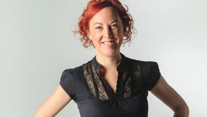

The San Diego Union-Tribune, January 2015

“<a href="https://www.eryary.sautebrandpartners.com/">The League of Amazing Programmers</a> is a nonprofit after school program that teaches kids the skill of computer programming.

Students from grades 5 to 12 go to the Carmel Valley-based campus and work with professional programmers on everything from creating games to making mobile phone apps.

June Clarke, 36, is the lead teacher at The League. The former software engineer left her private consulting company to take on the role of an educator.

The North Park resident, who moved to San Diego from her native Ireland in 2001, explains why she’s so passionate about her new career path.”

<a href="http://www.utsandiego.com/news/2015/jan/13/league-of-amazing-programmers-june-clarke/" rel="noopener" target="_blank">…read more!</a>

