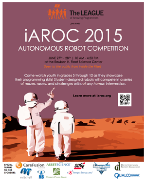

La Jolla Patch, 2015

“Watch student-designed autonomous robots go through their paces with no human intervention.

The 8th annual International Autonomous Robot Competition (iARoC) is a friendly competition that will be held at the Reuben H. Fleet Science Center on June 27th &amp; 28th 10am-4pm. Come watch self-driving robots created by student programmers in grade 5-12 compete in mazes, races and special challenges. More information at <a href="http://iaroc.org/" rel="nofollow noopener" target="_blank">iaroc.org</a>.”

<a href="http://patch.com/california/lajolla/self-driving-robot-competition-reuben-h-fleet-science-center">…read more!</a>

