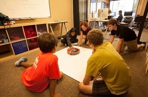

Del Mar Times Newspaper, June 2015

“More than 75 students from across California will participate in the eighth annual Autonomous Robotics Competition (iAROC) at the Reuben H. Fleet Science Center in Balboa Park.

Student-programmed, Roomba-style robots will compete in races, challenges, and mazes on Saturday, June 27, and Sunday, June 28.

Anyone with a Fleet ticket can watch this two-day competition from inside the museum.

“This is a friendly competition,” says Vic Wintriss, founder of The League of Amazing Programmers, which hosts the event. “The kids form teams and get to know each other … they support each other and cheer each other on.”

The contestants are an enthusiastic bunch. They attend RoboCamp, a free weeklong camp where they make final adjustments to their robots and prepare for competition weekend.”

