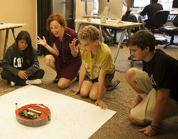
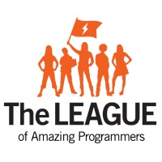

By: Sherry Booth Freeman, Ph.D.

NC State Unniversity

“One of the greatest challenges facing the U.S. technology economy today is a crucial shortage of skilled and trained information technology professionals. While there are currently more than  half a million open jobs across every industry that require computing skills, employers are only able to fill an estimated 30% of the positions. Further, of the positions that are filled there is a near absence of minority groups. The computer science “pipeline problem,” as well as gender and racial disparity in the field bring to light equity issues of access and participation in computer science that must be addressed

Vic Wintriss, a former Navy pilot, electrical engineer and owner of three successful electronic manufacturing businesses, is doing his part to address both of those challenges. Ten years ago, Vic and his wife, Diane, formed<a href="https://www.eryary.sautebrandpartners.com/"> The LEAGUE of Amazing Programmers</a> in San Diego, CA. The LEAGUE is a 501c(3) non-profit programming school with a mission of igniting young minds through programming. Providing students with a direct entry path into the workforce is a key mission of the school. Wintriss explains,

<i>“Teaching kids programming helps to address two critical problems: It helps with this country’s computer programmer shortfall, but more importantly, it helps to reduce inequalities in youth outcomes. I believe that the problem of income disparity in this country is in reality an educational problem. Teaching underserved kids programming helps to reduce the barriers that prevent them from achieving their potential in academic and economic realms.”</i>

