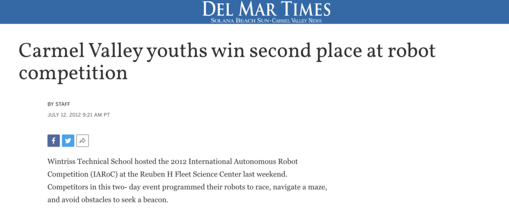

Del Mar Times Newspaper, July 12, 2012

“Wintriss Technical School hosted the 2012 International Autonomous Robot Competition (IARoC) at the Reuben H Fleet Science Center last weekend.  Competitors in this two- day event programmed their robots to race, navigate a maze, and avoid obstacles to seek a beacon.”

<a href="http://www.delmartimes.net/sddmt-carmel-valley-youths-win-second-place-at-robot-2012jul12-story.html">…read more</a>

