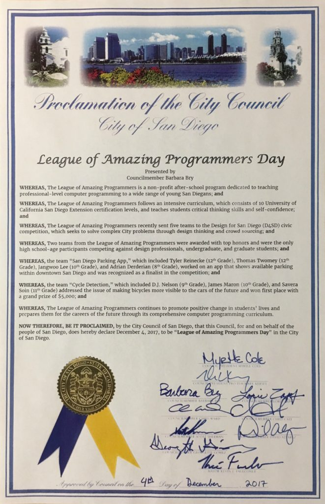
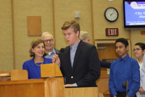
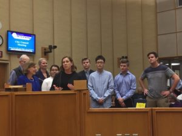

<h4><strong>IT’S OFFICIAL!</strong> 
<strong> December 4, 2017 is </strong><strong>LEAGUE OF AMAZING PROGRAMMER DAY in San Diego</strong></h4>

The LEAGUE was officially recognized by the City Council of San Diego for its achievements in teaching java programming to kids and for winning the D4SD challenge.

    

Big thanks to our local City Council person and champion Barbara Bry for recognizing us.  Two teams of League students along with their parents were invited to the City Council chambers last Monday to receive their own copy of the official proclamation.  The League was also represented by League teacher Stephen Cerruti, Executive Director Vickie Barks, Director Community Relations Becky Deller, Founder Vic Wintriss, League Board members Eric Busboon and Savi Soin.

<strong>We look forward to celebrating this AMAZING day every year on December 4th going forward!</strong>

