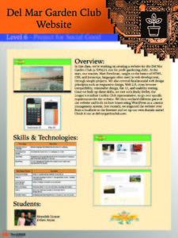
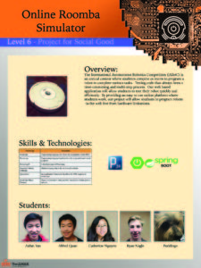
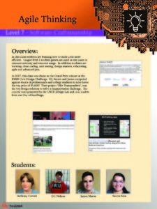
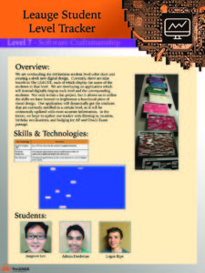
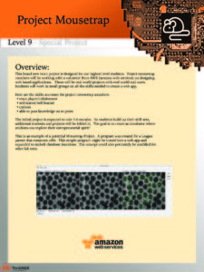
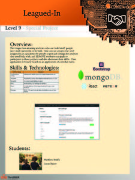
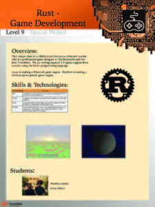

In May, upper-level students working on special projects had a chance to present their work at The LEAGUE’s annual Parents’ Night.  The projects ranged in topic from a website for the Del Mar Garden Club to a program to help aid in the scientific study of mice.  Check out the posters below and see what some of our most advanced students have been up to!

  

