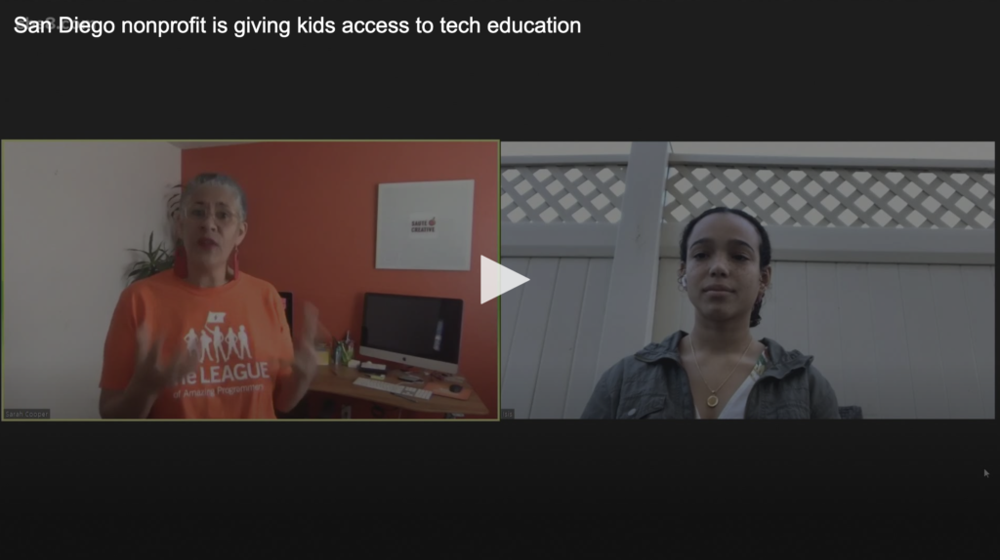

<strong>Executive Director of The League of Amazing Programmers, Sarah Tuakli along with student, Isis talked about the program and how they are helping kids.</strong>

Author: cbs8.com Published: December 1, 2020

<a href="https://www.cbs8.com/video/news/local/morning-extra/the-league-of-amazing-programmers/509-e1c59867-e13c-430e-9149-0a288e9f5812" rel="noopener noreferrer" target="_blank">Link to Original Post</a>

