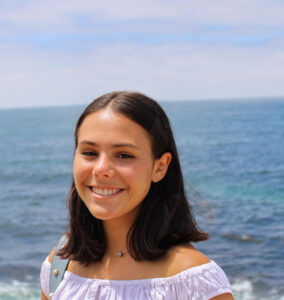
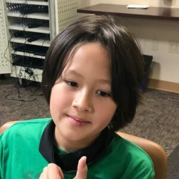
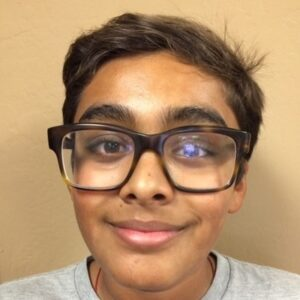

When the first cases of COVID-19 began to appear in early 2020, hospitals were overloaded and emergency rooms did not have enough life-saving ventilators. To address the problem, a team of students at The League of Amazing Programmers, a Carmel Valley non-profit after-school coding class, began designing a low-cost, ventilator system using easily available components…an Ambu bag (bag valve mask) and a Raspberry Pi computer. An Ambu bag is a hand-held tool that is used to deliver positive pressure ventilation to a patient with insufficient or ineffective breathing and can be purchased online for less than $20. The Raspberry Pi is a popular computer system that is used by hobbyists and costs less than $50.

Team members included Dalia Sebat, 18, who graduated from CCA and is now attending UCSB studying computer science, Rowan Law, 15 who is in the 9th grade and Yashwin Madakamutil, 18, who created the mechanical drawings for 3D printing of the prototype enclosure. Yashwin graduated from CCA this year is now attending UCSD.

Dalia Sebat

Rowan Law

Yashwin Madakamutil

The League of Amazing Programmers is the only school in the U.S. that offers professional-level, after-school coding education to middle school and high-school aged students – both live online and in-person. The weekly, ten-level, after-school classes teach coding by introducing carefully crafted action and game assignments that lead students through basic coding concepts in a fun-filled way. By the time they reach Level 4, students 
have progressed sufficiently to pass the computer science AP exam…special prep classes ensure that students are fully prepared to pass the AP exam and get honors course credits. At Level 8, preparation for the Oracle programming exam begins. The Oracle certificate is a well respected industry credential and most employers will accept the Oracle Certification for employment as a computer programmer. Since the school was founded in 2006, forty-eight students have mastered the difficult the Oracle exam.

The League offers year-round, after-school and weekend classes both at its main campus in Carmel Valley and works with selected schools and libraries throughout the city of San Diego. Our teachers are professional programmers, many of whom volunteer their time to work with students and ensure that the school stays up-to-date with current practice.

