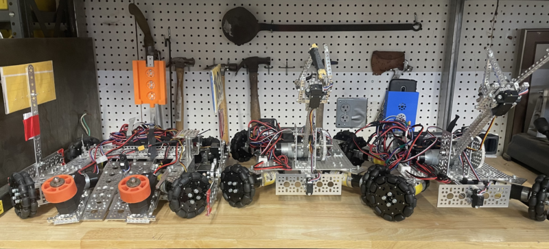

For several years before the pandemic, the LEAGUE had a FIRST Tech Challenge Robotics (FTC) Team, but we have not run it in recent years. FTC is the second tier of the FIRST robotics program, easier and less expensive than the top-tier FRC program. Regardless, the challenges are the same and the programming is similar. Here is our fleet of three robots from the last competition we entered in 2022:

And, we’ve had some wins in the past; in 2017, an FTC team at R. Roger Rowe Middle school, in which all of the programmers were LEAGUE students, <a href="https://www.jointheleague.org/2017/02/07/league-students-place-1st-in-first-tech-challenge-robotics-competition/">took a first in regional competition. </a>

Building and running these robots is a competitive team sport, and they are programmed in Java, so your student will not only get a new technical challenge to tackle, but will develop better programming skills along with team camaraderie.

If you or your student is interested in joining a new robotics team, please fill out the contact form below. This team will be sponsored by The LEAGUE, but we will need a lot of parents to help with mentoring students, contacting sponsors, and many other tasks.

<h2>Interest Form</h2>
